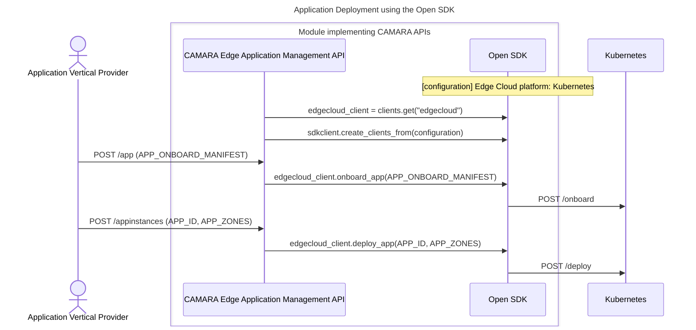

# OpenSDK

Open source SDK to abstract CAMARA/GSMA Transformation Functions (TFs) for Edge Cloud platforms, 5G network cores and O-RAN solutions.

## Features

- Unified SDK for interacting with Edge Cloud platforms, 5G Core solutions, and O-RAN solutions.
- Modular and extensible adapter structure
- Conforms to CAMARA/GSMA API standards.

---

## API & Platform Support Matrix

### CAMARA APIs

| API Name             | Version      |
|----------------------|--------------|
| Edge Application Management            | v0.9.3-wip   |
| Quality-on-Demand    | v1.0.0       |
| Location Retrieval   | v1.0.0       |
| Traffic Influence    | v0.8.1       |

### EdgeCloud Platforms

| Platform   | Status     |
|------------|------------|
| Kubernetes | To be supported soon |
| i2Edge     | Supported  |
| aerOS      | Supported  |

### Network Adapters

| Platform     | NEF Version | QoD | Location Retrieval | Traffic Influence |
|--------------|-------------|-----|---------------------|--------------------|
| Open5GS      | v1.2.3      | ✅  | ✅                  | ❌                 |
| Open5GCore   | v1.2.3      | ✅  | ❌                  | ❌                 |
| OAI          | v1.2.3      | ✅  | ❌                  | ✅                 |

---

## How to Use

### Option 1: Install via PyPI

For end users:

```bash
pip install sunrise6g-opensdk
```

### Option 2: Development Mode

If you plan to modify the SDK:

```bash
git clone https://github.com/<your-org>/sunrise6g-opensdk.git
cd sunrise6g-opensdk
pip install -r requirements.txt
```

### Basic Usage

You can use the SDK by simply specifying the adapters to be used. E.g. i2Edge and Open5gs

```python
from sunrise6g_opensdk import Sdk as sdkclient

def main():
    client_specs = {
        "edgecloud": {
            "client_name": "i2edge",
            "base_url": "http://IP:PORT",
        },
        "network": {
            "client_name": "open5gs",
            "base_url": "http://IP:PORT",
            "scs_as_id": "id_example",
        },
    }

    clients = sdkclient.create_clients_from(client_specs)
    edgecloud_client = clients.get("edgecloud")
    network_client = clients.get("network")

    print(edgecloud_client.get_edge_cloud_zones())
    print(network_client.get_qod_session(session_id="example_session_id"))


if __name__ == "__main__":
    main()
```

Example available in [`/examples/example.py`](examples/example.py)

---

## How to Contribute

We welcome contributions to OpenSDK!

To get started:

1. Fork the repository and create a branch from `main`.
2. Add your changes in the appropriate adapter directory.
3. Write or update tests for your changes.
4. Ensure all tests and pre-commit checks pass.
5. Submit a pull request with a clear description.

Please follow our full [Contributing Guidelines](docs/CONTRIBUTING.md) for details on:
- Directory structure
- Branch naming conventions
- Coding standards (PEP8, docstrings)
- Pre-commit setup
- Reporting issues

---

## Example Workflow (Mermaid)



---

## Roadmap

- [ ] Add support to GSMA OPG.02 TFs (WIP)
- [ ] Include JUNIPER O-RAN adapter (WIP)

---

## License

Apache 2.0 License – see [`LICENSE`](LICENSE) file for details.
