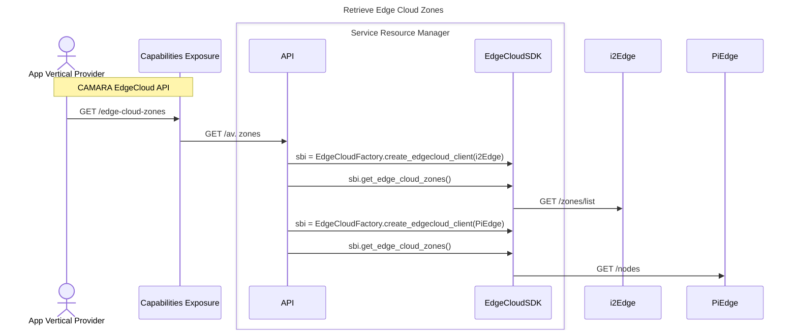

# OpenSDK

Open source SDK to abstract CAMARA/GSMA Transformation Functions (TFs) for Edge Cloud platforms & 5G network cores

## Contributing Guidelines
Thank you for contributing to this project. Please follow the guidelines below to ensure a smooth collaboration.

### Directory Structure
Each contribution should be made in the appropriate directory:
- **EdgeCloud Adapters** → `src/edgecloud/clients/`
- **Network Adapters** → `src/network/clients/`

### Testing (Mandatory)
To merge a feature branch into `main`, the adapter **must pass the unit tests**. Instructions to do so available at [TESTING.md](docs/TESTING.md)

### Contributing
1. **Check Guidelines at [CONTRIBUTING.md](docs/CONTRIBUTING.md).**
2. **Create a New Branch** following the naming convention.
3. **Develop Your Feature** inside the correct directory.
4. **Ensure All Tests Pass**  before the merge.
5. **Submit a Merge Request (MR)** to the `main` branch.

### Branch Naming Convention
Each partner should create a feature branch following the naming convention based on the type of adapter they are contributing:

#### ☁️ EdgeCloud Adapters
Branch Name Format:
```
feature/add-edgecloud-<EDGE_CLOUD_PLATFORM_NAME>
```
Example:
```
feature/add-edgecloud-i2edge
```

#### 🌐 Network Adapters
Branch Name Format:
```
feature/add-network-<5G_CORE_NAME>
```
Example:
```
feature/add-network-open5gs
```

## Sequence Diagram Example
Refer to the sequence diagram example from `docs/workflows/edgecloud/get_av_zones.md` for guidance on workflow structure:


