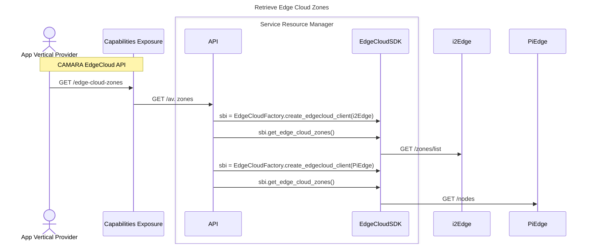

# OpenSDK - Contribution Guidelines

Thank you for contributing to this project! Please follow the guidelines below to ensure a smooth collaboration.

## Branch Naming Convention
Each partner should create a feature branch following the naming convention based on the type of adapter they are contributing:


### ☁️ EdgeCloud Adapters
Branch Name Format:
```
feature/add-edgecloud-<EDGE_CLOUD_PLATFORM_NAME>
```
Example:
```
feature/add-edgecloud-i2edge
```

### 🌐 Network Adapters
Branch Name Format:
```
feature/add-network-<5G_CORE_NAME>
```
Example:
```
feature/add-network-open5gs
```

## Directory Structure
Each contribution should be made in the appropriate directory:
- **EdgeCloud Adapters** → `src/edgecloud/clients/`
- **Network Adapters** → `src/network/clients/`

## Unit Tests Requirement
To merge a feature branch into `main`, the adapter **must include unit tests** under the `/tests` directory.
Ensure that your unit tests cover the main functionalities of the adapter.

## Steps to Contribute
1. **Fork the Repository** (if applicable).
2. **Create a New Branch** following the naming convention.
3. **Develop Your Feature** inside the correct directory.
4. **Write Unit Tests** under `/tests`.
5. **Submit a Merge Request (MR)** to the `main` branch.
6. **Ensure All Tests Pass** before the merge.

## Sequence Diagram Example
Refer to the sequence diagram example from `docs/workflows/edgecloud/get_av_zones.md` for guidance on workflow structure:


