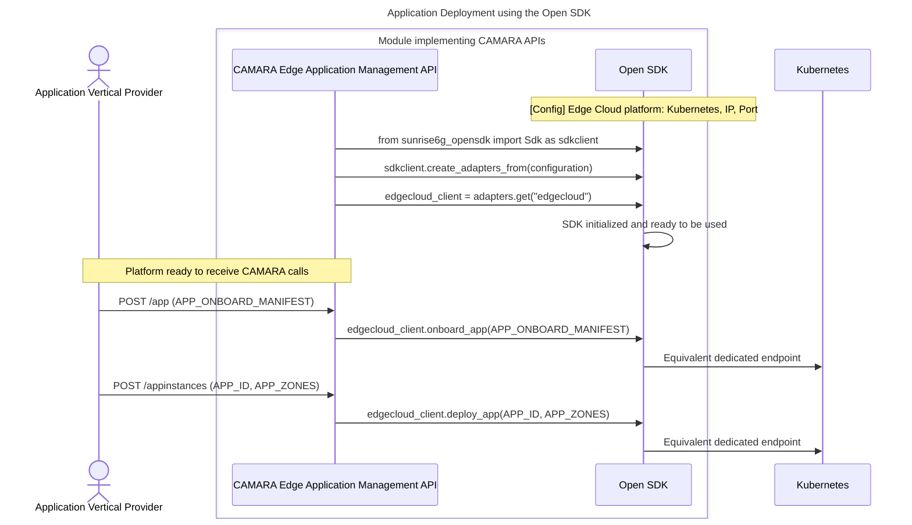
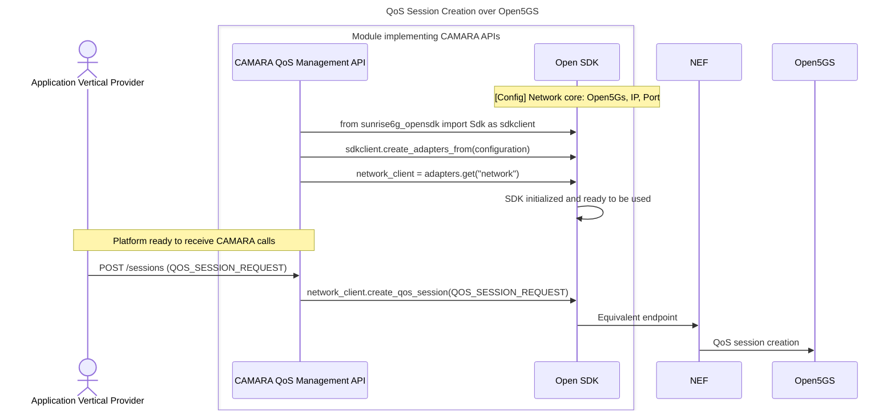

<a href="https://github.com/SunriseOpenOperatorPlatform/open-sdk/actions/workflows/ci.yaml" title="CI Status">
  
</a>
<a href="https://github.com/SunriseOpenOperatorPlatform/open-sdk/commits/" title="Last Commit">
  
</a>
<a href="https://github.com/SunriseOpenOperatorPlatform/open-sdk/issues" title="Open Issues">
  
</a>
<a href="https://github.com/SunriseOpenOperatorPlatform/open-sdk/pulls" title="Open Pull Requests">
  
</a>
<a href="https://github.com/SunriseOpenOperatorPlatform/open-sdk/graphs/contributors" title="Contributors">
  
</a>
<a href="https://github.com/SunriseOpenOperatorPlatform/open-sdk/blob/main/LICENSE" title="License">
  
</a>
<a href="https://github.com/SunriseOpenOperatorPlatform/open-sdk/releases/latest" title="Latest Release">
  
</a>


# OpenSDK

Open source SDK to abstract CAMARA/GSMA Transformation Functions (TFs) for Edge Cloud platforms, 5G network cores and O-RAN solutions.

## Features

- Abstract CAMARA Transformation Functions (TFs)
- Unified Python SDK for interacting with Edge Cloud platforms, 5G Core solutions, and O-RAN solutions.
- Modular and extensible adapter structure


---

## API & Platform Support Matrix

### CAMARA APIs

| API Name                  | Version |
|---------------------------|---------|
| Edge Application Management | [v0.9.3-wip](https://raw.githubusercontent.com/camaraproject/EdgeCloud/main/code/API_definitions/Edge-Application-Management.yaml) |
| Quality-on-Demand         | [v1.0.0](https://raw.githubusercontent.com/camaraproject/QualityOnDemand/refs/tags/r2.2/code/API_definitions/quality-on-demand.yaml) |
| Location Retrieval        | [v0.4.0](https://raw.githubusercontent.com/camaraproject/DeviceLocation/refs/tags/r2.2/code/API_definitions/location-retrieval.yaml) |
| Traffic Influence         | [v0.8.1](https://raw.githubusercontent.com/camaraproject/EdgeCloud/v0.8.1/code/API_definitions/Traffic_Influence.yaml) |

### EdgeCloud Platforms

| Platform   | Status     |
|------------|------------|
| Kubernetes | ✅  |
| i2Edge     | ✅  |
| aerOS      | ✅  |

### Network Adapters

| Platform     | NEF Version | QoD | Location Retrieval | Traffic Influence |
|--------------|-------------|-----|---------------------|--------------------|
| Open5GS      | [v1.2.3](https://www.3gpp.org/ftp/Specs/archive/29_series/29.122/29122-hc0.zip) TS 29.122 (v17.12.0) | ✅  | ✅                  | ❌                 |
| Open5GCore   | [v1.2.3](https://www.3gpp.org/ftp/Specs/archive/29_series/29.122/29122-hc0.zip) TS 29.122 (v17.12.0) | ✅  | ❌                  | ❌                 |
| OAI          | [v1.2.3](https://www.3gpp.org/ftp/Specs/archive/29_series/29.122/29122-hc0.zip) TS 29.122 (v17.12.0) | ✅  | ❌                  | ✅                 |

---

## How to Use

### Option 1: Install via PyPI

For end users:

```bash
pip install sunrise6g-opensdk
```

### Option 2: Development Mode

If you plan to modify the SDK:

```bash
git clone https://github.com/SunriseOpenOperatorPlatform/open-sdk.git
cd open-sdk
python3 -m venv .venv
source .venv/bin/activate
pip install -r requirements.txt
pip install -e .
```

### Basic Usage

You can use the SDK by simply specifying the adapters to be used. E.g. Edge Cloud Platform: i2Edge, 5G core: Open5Gs

Example available in [`/examples/example.py`](examples/example.py)

```python
python3 -m examples.example
```

---

## How to Contribute

We welcome contributions to OpenSDK!

To get started:

1. Fork the repository and create a branch from `main`.
2. Add your changes in the appropriate adapter directory.
3. Write or update tests for your changes.
4. Ensure all tests and pre-commit checks pass.
5. Submit a pull request with a clear description.

Please follow our full [Contributing Guidelines](docs/CONTRIBUTING.md) for further details.

---

## Example Workflow #1: App deployment over Kubernetes



## Example Workflow #2: QoS Session Creation over Open5Gs


---

## Roadmap for Open SDK 2nd release

- [ ] Add support to GSMA OPG.02 TFs
- [ ] Include JUNIPER O-RAN adapter

---

## License

Apache 2.0 License – see [`LICENSE`](LICENSE) file for details.
