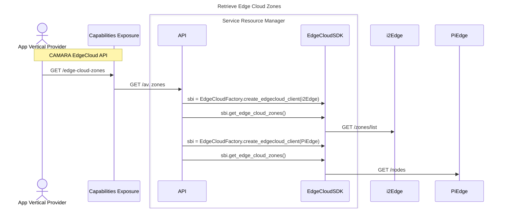

```mermaid
sequenceDiagram
title Retrieve Edge Cloud Zones
actor AP as App Vertical Provider
participant CE as Capabilities Exposure
box Service Resource Manager
    participant API
    participant SDK as EdgeCloudSDK
end
participant i2Edge
participant PiEdge

note over AP,CE: CAMARA EdgeCloud API
AP ->> CE: GET /edge-cloud-zones
CE ->> API: GET /av. zones
API ->> SDK: sbi = EdgeCloudFactory.create_edgecloud_client(i2Edge)
API ->> SDK: sbi.get_edge_cloud_zones()
SDK ->> i2Edge: GET /zones/list
API ->> SDK: sbi = EdgeCloudFactory.create_edgecloud_client(PiEdge)
API ->> SDK: sbi.get_edge_cloud_zones()
SDK ->> PiEdge: GET /nodes
```
